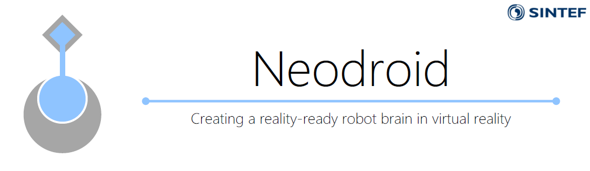
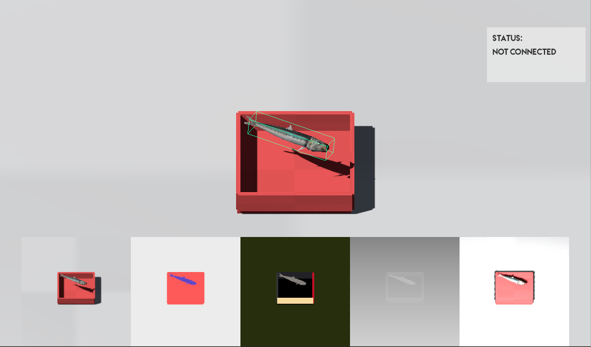
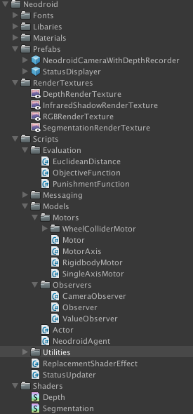
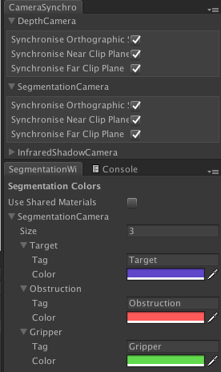

# Droid
Droid is a unity package that enables prototyping reinforcement learning environments and communication to the [Neo](https://github.com/sintefneodroid/neo) counterpart of the [Neodroid](https://github.com/sintefneodroid) platform.

## Screenshot Of The Game View With The Droid Unity Package

## Features
The unity comes quite selection of scripts and tools for setting up and experimenting reinforcement learning environments.

(Outdated images)

### Objective Functions (Out Of The Box, Easily Extendable)
- euclidean distance between objects

### Types Of Observations (Out Of The Box, Easily Extendable)
- positions
- rotations
- bounding boxes of objects
- instance segmentation images
- segmentation images
- depth images
- infrared shadow images
- rgb images

### Types Of Motors (Out Of The Box, Easily Extendable)

- rigidbody motors
- single Axis Transform motors
- wheel motors for vehicles

### Many Custom Windows For Quick Prototyping

# To Do's
- [ ] Exponential Proximity Regularisation Penalty
- [ ] Reset properly
- [ ] Make an option for transforms all coordinates into camera relative or other reference point
- [ ] Be able to send a configure cmd to change the environment, like frame skips/sampling rate, time scale, problem difficulty, evaluation function paramaters(term weighting)

# Other Components Of The Neodroid Platform

- [agent](https://github.com/sintefneodroid/agent)
- [simulation](https://github.com/sintefneodroid/simulation)
- [neo](https://github.com/sintefneodroid/neo)